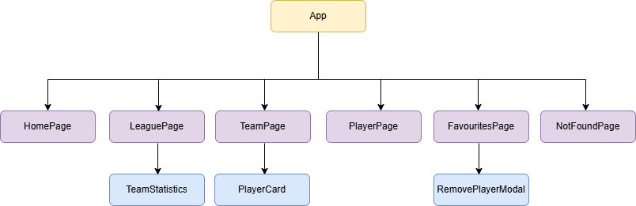

# ⚽ Football Database App

## 📌 Project Summary

The **Football Database App** is a React-based web application that provides historical football data for the **Top 5 European leagues**:

- Premier League
- La Liga
- Serie A
- Bundesliga
- Ligue 1

Users can:

- Browse **league standings by season**
- View **team profiles**
- Explore **player profiles**
- **Add players to favourites**, which are persisted in a database

### ⚠️ API Limitations

This project uses the **API-Football Free Plan**, which has the following constraints:

- **Season data limited to 2021 – 2023**
- **100 API requests per day**

## 🧱 Features Overview

### 🏆 League & Standings

- Select league and season
- View league table with:
  - Position
  - Team
  - Matches played
  - Wins / Draws / Losses
  - Goals For / Against
  - Goal Difference
  - Points
- Promotion / relegation descriptions (where available)

### 👕 Team Page

- Team details
- Squad list
- Navigation to individual player profiles

### 👤 Player Page

- Player personal information
- Position, jersey number, nationality
- Player photo
- Add to favourites functionality

### ⭐ Favourites

- Persist favourite players in **Airtable**
- View favourites without navigating through leagues/seasons
- Remove players from favourites

## 🛠 Tech Stack

| Technology                                     | Purpose                           |
| ---------------------------------------------- | --------------------------------- |
| **React (JavaScript)**                         | Frontend UI                       |
| **TanStack React Query**                       | Data fetching, caching, mutations |
| **Tailwind CSS**                               | Styling                           |
| **API-Football** https://www.api-football.com/ | Football data source              |
| **Airtable** https://airtable.com/             | Database for favourites           |

## 🌳 React Component Tree Diagram

**Diagram:**  


## 🤖 AI-Assisted Development

This project was developed using **Gemini CLI**, with additional assistance from **ChatGPT**.

**Initial Prompt**

```
There is a starter code for react app in this project folder “football database app” with the required node-modules installed. Extend the react starter code to the actual application requirements and create the necessary components and js files. The app makes use of API-football to retrieve the information, and uses airtable API to store favourite information. Note that I am using a free account for API-football which has a maximum of 100 API calls per day so the app is to cache the information and re-use when required. (example, change of seasons). The season information from API football is also limited to 3 seasons, 2021 to 2023 for the free tier account which will also be the limitation for this web app. Use tanstack react query to address querying, mutation and caching needs. The app will show these pages, home page, a league season page, a team page, a player page and a favourites page. For API fetches from the endpoints, use async await fetch calls.

The home page allows to select a season of 2021 to 2023. and has a league selector for the following: English Premier League(ENG), La Liga (ESP), Seria A(ITA), Bundesliga(GER), Ligue1 (FRA). The IDs of these 5 leagues in api-football are 39, 140, 135, 78 and 61 respectively, and to be stored in the code base for selection.

At the league page, shows the country and league logo and the selected season. Using the standings endpoint to fetch from API football, show standings for the selected season with the following information: Rank, team, all games played, games won, games drawn, games lost, number of goals scored, number of goals conceded, goals difference and total points. There should be team logos for the respective teams in the standings table. Information on promotion to champions league or Europa league, as well as relegation to the lower tier to be provided at the below of table. In the same league page, there should be a top scorer list for the top 5 scorers. The list should contain the scorer’s name, club, and number of goals for the season. Each team in the standings should have a link whereby clicking on the team’s name will bring us to the team page based on the id of team returned through the API call (e.g Manchester United). Each top scorer in the list should also have a link that direct to it’s player page. The league season page should have a button to go back to the home page

The team page will show a list of team players through the players/squads endpoint which is the current team as per current time. The info for the team will show name of player, age, jersey number, position and the photo. The players table should be breakdown into 2 sections, the goal keepers, and out field
players. The outfield players will be in the order of Defender, midfielder and forward. Each player in the listed in the team will have a link whereby clicking on the player’s name will bring us to its player page. The team page should have a button to return to the league season page

The player page will display all fetched data in the API from the /players/profile endpoint such as name, age, birth information (date, place, country), nationality, height, weights, jersey number, position and photo. There should be a button to add the player to favourites. Clicking on the button will call
a POST request to store the same set of information, as well as the player ID information into airtable. There will be some form of highlight to show that a player has been added to the favourites. The data field in the airtable mapping to the players/profile response from API football are shown as per below. If not specifically indicated by the // short text, they are generated as single line text in airtable

externalId : player.id // type number
name: player.name
firstname: player.firstname
lastname: player.lastname
age: player.age
birthDate: player.birth.date // type Date
birthPlace: player.birth.place
birthCountry: player.birth.country
nationality: player.nationality
height: player.height
weight: player.weight
number.player.number
position: player.position
photo: player.photo

The API to add to airtable should always check against duplication of id before creating the record
The favourites pages will display a list of favourite players. Clicking upon each player will jump to the respective player’s page. The favourites page link should be available in every home, league, team and player pages, to allow the user to jump to the favourites at any point of time. In the favourite
list, there will be a button for each player, that will allow itself to remove from favourites. The button will send a DELETE request to remove the player from airtable with an input of the player id. The application will load the favourites at the start and when browsing teams and on selecting of players, the default is to load from airtable and only fetch from API football if the player record is non-existent.

On the page routing in react set for the

1. home page at /home
2. league page with /league/:leagueID/:season
3. team page at /team/:teamid
4. player page at /player/:playerId
5. favourites page at /favourites

For this project, create an env file to hold the football API key with variable FOOTBALL_API_KEY =”” and AIRTABLE_TOKEN=”” with the empty strings to be filled by myself later For airtable api, use https://api.airtable.com/v0/baseId/table.
```

## 🗄 Airtable Database Schema

The Airtable table was created with the following columns:

| Column Name  | Type              |
| ------------ | ----------------- |
| externalId   | Number            |
| name         | Single line text  |
| firstname    | Single line text  |
| lastname     | Single line text  |
| birthDate    | Date (ISO format) |
| birthPlace   | Single line text  |
| birthCountry | Single line text  |
| nationality  | Single line text  |
| height       | Single line text  |
| weight       | Single line text  |
| number       | Number            |
| position     | Single line text  |
| photo        | URL               |

## 🚀 Project Setup

This section describes how to set up and run the project locally.

### ✅ Prerequisites

Before running the project, ensure the following are available:

- **Node.js** (version 24 or later recommended)
- An **API-Football** account
- An **Airtable** account with a base and table created

### 📥 Installation Steps

1. Clone the project repository

```
git clone https://github.com/yeohongwei/Football-Database-App.git
cd Football-Database-App
```

### 🔐 Environment Variables

Create a `.env` file at the project root and add the following environment variables:

```
VITE_FOOTBALL_API_KEY="api_football_api_key"
VITE_AIRTABLE_TOKEN="airtable_token"
VITE_AIRTABLE_BASE_ID="airtable_base_id"
VITE_AIRTABLE_TABLE_NAME="airtable_table_name"
```

### 📦 Install Dependencies

```
npm install
```

### ▶️ Run the Application

```
npm run dev
```

The application will be available at:

```
http://localhost:5173
```

## 📘 Key Learnings & Takeaways

Through this project, I gained a deeper understanding of using **tanstack react query** for modern React application development.

- Using of `useMemo` for derived states
- Using `select` in `useQuery` to normalize API responses

A key takeaway for myself is that **many React bugs are caused by incorrect hook setup**, rather than the application logic itself. Careful hook usage significantly improves stability and maintainability.

## 📎 Notes

- Live fixtures are not included due to **API-Football free plan limitations**
- All displayed data is **historical (2021–2023 seasons)**
